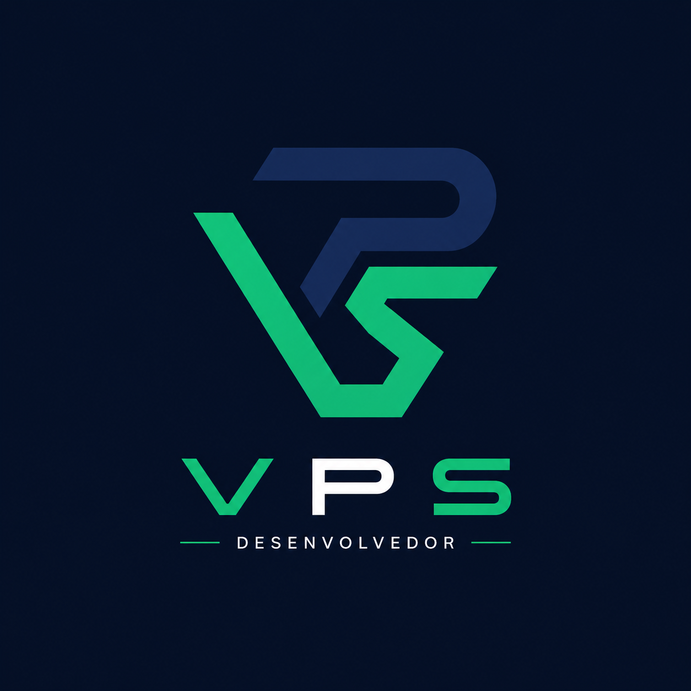

  
  <!-- Logo VPS em SVG puro (funciona 100% no GitHub) -->
  <svg width="80" height="80" viewBox="0 0 80 80" fill="none" xmlns="http://www.w3.org/2000/svg">
    <rect x="4" y="12" width="22" height="56" rx="4" fill="#10B981" opacity="0.9"/>
    <rect x="28" y="20" width="22" height="48" rx="4" fill="#10B981" opacity="0.6"/>
    <rect x="52" y="16" width="22" height="52" rx="4" fill="#10B981" opacity="0.3"/>
    <circle cx="15" cy="24" r="3" fill="#0F172A"/>
    <circle cx="39" cy="32" r="3" fill="#0F172A"/>
    <circle cx="63" cy="28" r="3" fill="#0F172A"/>
  </svg>

  <h1 style="font-family: monospace; font-size: 36px; color: #0F172A; margin: 10px 0 0 0;">
    Vinícius Pereira Santana
  </h1>
  
  

    VPS • SOFTWARE DEVELOPER
  

  
  
  

    Backend Developer focado em Python, FastAPI e arquitetura de sistemas.
    Construindo marketplaces e soluções escaláveis.
  

  <!-- Badges com as cores VPS -->
  

    
    
    
    
    
  

---

<!-- Layout em duas colunas usando tabela -->
<table>
  <tr>
    <td width="50%" valign="top">
      <h2>🚀 Projetos</h2>
      <ul>
        <li>
          <a href="https://github.com/Vinisantas/raizes_do_nordeste">
            <strong>Raízes do Nordeste</strong>
          </a>
           
          Marketplace Backend • FastAPI • JWT • PostgreSQL
        </li>
         
        <li>
          <strong>VPS Marketplace</strong> (em breve)
           
          Marketplace multi-loja • RabbitMQ • Vue.js
        </li>
      </ul>
    </td>
    <td width="50%" valign="top">
      <h2>📊 Estatísticas</h2>
      
    </td>
  </tr>
</table>

---

<!-- Seção expansível (detalhes técnicos) -->

  
<strong>🛠️ Stack Completa</strong>

   
  <table>
    <tr>
      <td><strong>Backend</strong></td>
      <td>Python • FastAPI • Node.js</td>
    </tr>
    <tr>
      <td><strong>Frontend</strong></td>
      <td>Vue.js • HTML/CSS • JavaScript</td>
    </tr>
    <tr>
      <td><strong>Banco de Dados</strong></td>
      <td>PostgreSQL • Redis</td>
    </tr>
    <tr>
      <td><strong>Mensageria</strong></td>
      <td>RabbitMQ</td>
    </tr>
    <tr>
      <td><strong>DevOps</strong></td>
      <td>Docker • GitHub Actions</td>
    </tr>
  </table>

---

  <h2>📫 Contato</h2>
  

    
    
    
  

  
   
  Feito por VPS

